[Lab: Xv6 and Unix utilities (mit.edu)](https://pdos.csail.mit.edu/6.828/2020/labs/util.html)

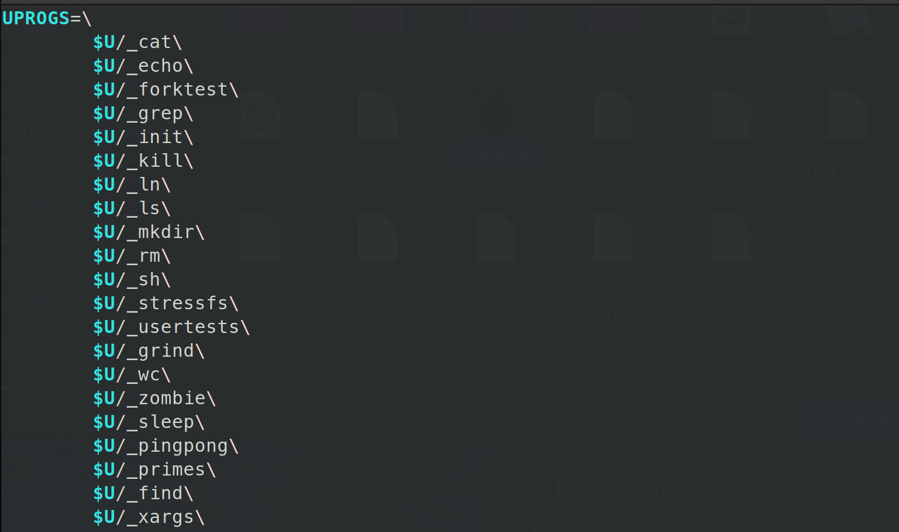

我们需要在makefile中把这五个文件加进来.

## sleep


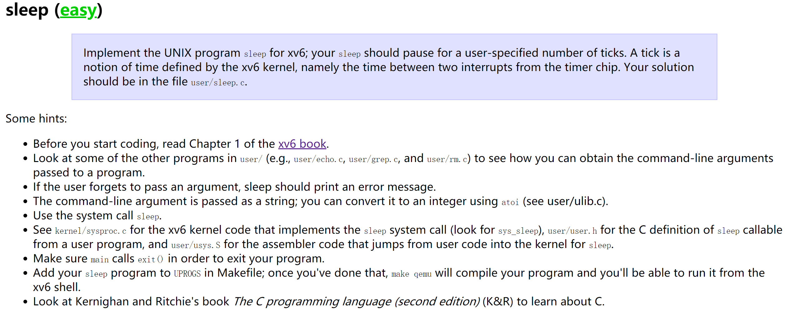

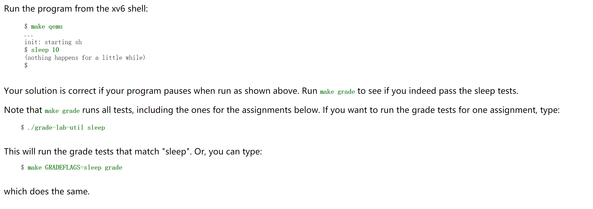

这个任务要求利用调用**系统调用函数sleep**完成sleep n

（但是这里还需要强调一下，在Hints中说得很清楚了，我们调用的是syscall的sleep，这时xv6提供的，而不是Linux环境中的< sys >中的sleep。）

`sleep.c`

```c
#include "../kernel/types.h"
#include "user.h"

int main(int argc, char *argv[]) {
    if (argc != 2){
        fprintf(2,"Usage: sleep ticks...\n");
        exit(1);
    }
    int ticks = atoi(argv[1]);
    sleep(ticks);
    exit(0);
}
```

结果:

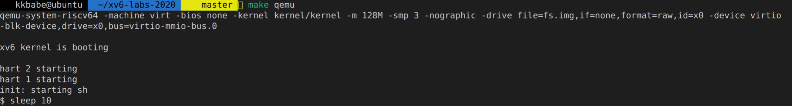

确实sleep了10秒.(但是为啥我感觉到的就只有两s...)

> [MIT6.S081/6.828 实验1：Lab Unix Utilities - 小黑电脑 (xiaoheidiannao.com)](https://www.xiaoheidiannao.com/11188.html)
>
> 我在这里查到了原因，这是因为xv6的一个tick为100ms，所以sleep(10)实际上是sleep 1s

测试:

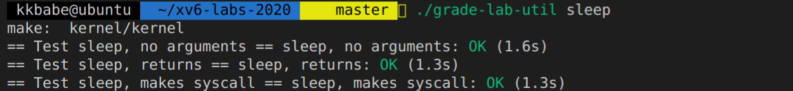

ok，通过了


## pingpong

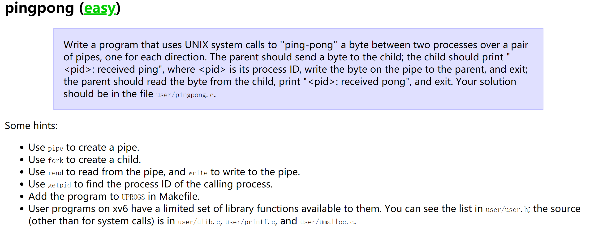

本任务要求实现利用管道实现进程间的通信：父进程发送ping，子进程收到后发送pong，父进程收到后将其打印出来.

**Hints 1：利用pipe()函数创建管道，pipe()函数接收一个长度为2的数组，数组下标0为读端、1为写端；**
**Hints 2：利用fork()函数创建新的进程；**
**Hints 3：利用read、write函数读写管道；**

也就是，在父进程的1(stdout)变成pipe1的写端，子进程的0(stdin)变成pipe1的读端.父进程的0(stdin)变成pipe2的读端，子进程的1(stdout)变成pipe2的写端.

其他我们的知道的，我们来看一下pipe的用法：

> 函数说明： pipe()会建立管道，并将文件描述词由参数filedes数组返回。
>        filedes[0]为管道里的读取端
>        filedes[1]则为管道的写入端

ok,我们懂了.

`pingpong.c`

```c
#include "../kernel/types.h"
#include "user.h"
/*pipe(arr):arr[0] read , arr[1] write*/
int 
main(int argc, char** argv ){
    int pid;
    int parent_fd[2];
    int child_fd[2];
    char buf[20];
    //为父子进程建立管道
    pipe(child_fd); 
    pipe(parent_fd);

    int child_write  = child_fd[1];
    int child_read   = parent_fd[0];
    int parent_write = parent_fd[1];
    int parent_read  = child_fd[0];

    // Child Progress
    if((pid = fork()) == 0){
        close(parent_write);  
        read(child_read,buf, 4);
        printf("%d: received %s\n",getpid(), buf);
        close(child_read); 
        write(child_write, "pong", sizeof(buf));
        exit(0);
    }
    // Parent Progress
    else{
        close(child_read);
        write(parent_write, "ping",4);
        close(child_write);
        read(parent_read, buf, sizeof(buf));
        printf("%d: received %s\n", getpid(), buf);
        exit(0);
    }

}

```

结果:


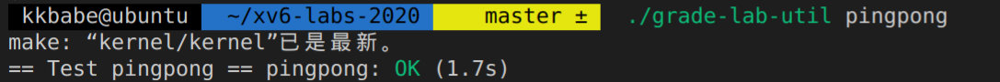


方案1的正确性是很容易证明的，因为父子进程读写是用的两个不同的pipe，先是子进程读，会一直read，直到父进程写到这个文件后，才会从read中返回。然后是父进程读，同样会一直read，直到子进程写到这个文件后，才会从read中返回。

关于read是否立即返回的问题，xv6-book是最好的答案：

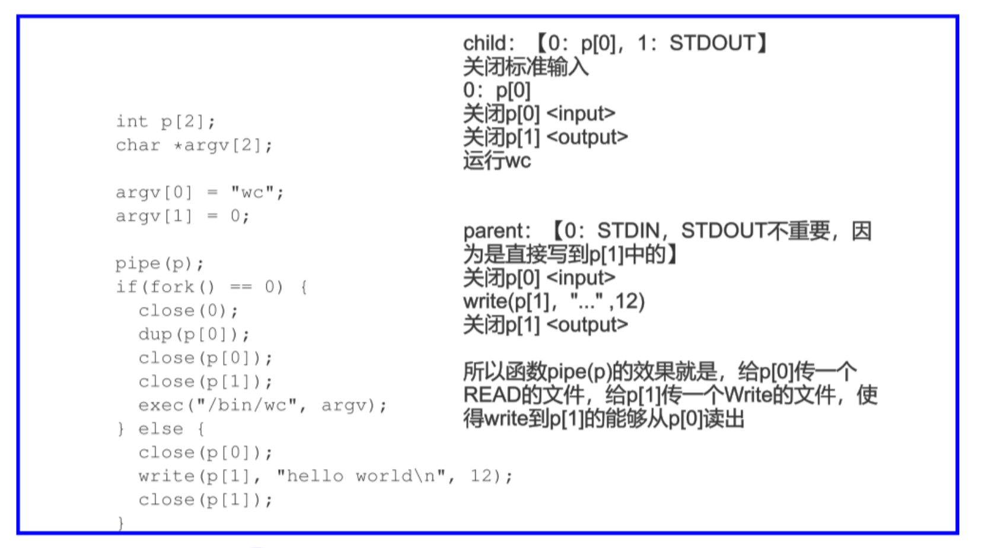

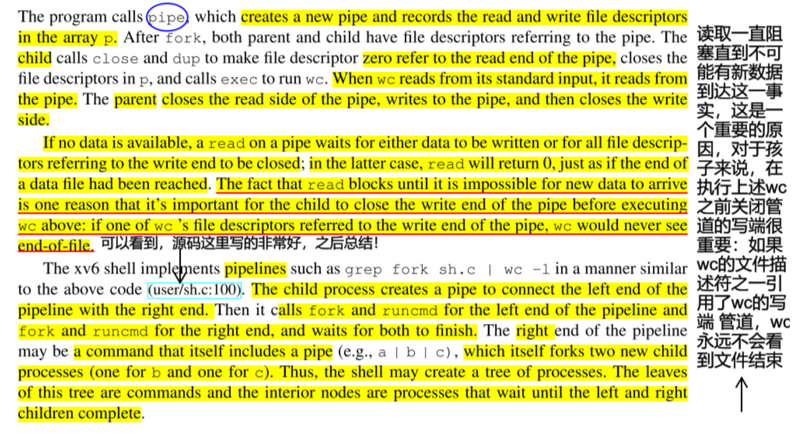

说的就是，我们要关闭所有的写端，这样才能使得read的时候不会一直阻塞，可以发现没有数据了然后返回0.

我们再来看看fork的情况:

```c
#include "csapp.c"
int main(){
    int fd = Open("a.txt",O_RDWR|O_APPEND, S_IRUSR|S_IWUSR);
    int pid = fork();
    if (pid ==0){
        // child 
        sleep(1);
        printf("child run:\n");
        char buf[10];
        int n = read(fd,buf,7);
        printf("n=%d,buf=%s\n",n,buf);
        printf("child end\n");
    }
    else{
        // parent
        printf("parent run:\n");
        char buf[10] = "kkbabe\n";
        write(fd,buf,7);
        printf("parent end\n");
        wait(0);
    }
    return 0;
}
```

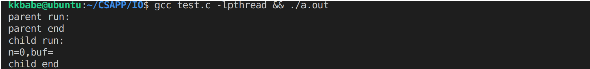


## primes

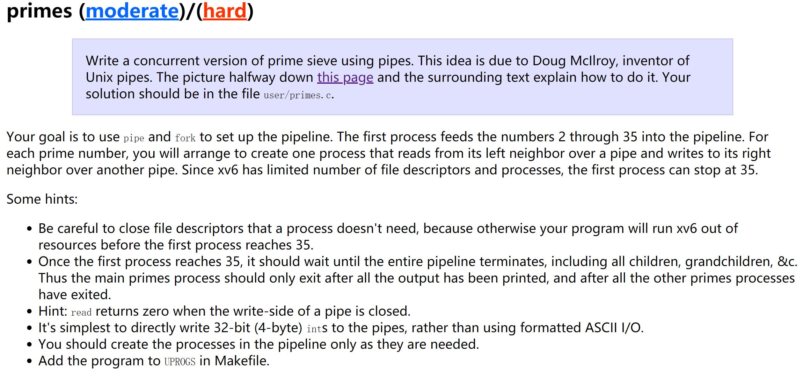

本任务要求完成**质数筛选器**。primes的功能是**输出2~35之间的素数**，实现方式是递归fork进程并使用管道链接，形成一条pipeline来对素数进行过滤。

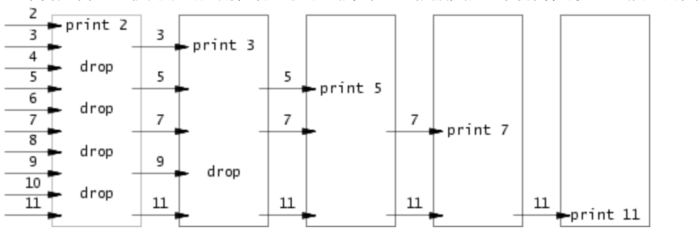

具体是什么意思呢？
它要求用fork和pipe实现：**输入为2 ~ 35，输出为2 ~ 35间的所有质数**，例如：2、3、5、7等。

每个进程收到的第一个数p一定是素数，后续的数如果能被p整除则之间丢弃，如果不能则输出到下一个进程，详细介绍可参考文档。伪代码如下：

```python
void primes() {
  p = read from left         // 从左边接收到的第一个数一定是素数
  if (fork() == 0): 
    primes()                 // 子进程，进入递归
  else: 
    loop: 
      n = read from left     // 父进程，循环接收左边的输入  
      if (p % n != 0): 
        write n to right     // 不能被p整除则向右输出   
}
```

> 还需要注意两点：
>
> - **文件描述符溢出：** xv6限制fd的范围为0~15，而每次pipe()都会创建两个新的fd，如果不及时关闭不需要的fd，会导致文件描述符资源用尽。这里使用重定向到标准I/O的方式来避免生成新的fd，首先close()关闭标准I/O的fd，然后使用dup()复制所需的管道fd（会自动复制到序号最小的fd，即关闭的标准I/O），随后对pipe两侧fd进行关闭（此时只会移除描述符，不会关闭实际的file对象）。
> - **pipeline关闭：** 在完成素数输出后，需要依次退出pipeline上的所有进程。在退出父进程前关闭其标准输入fd，此时read()将读取到eof（值为0），此时同样关闭子进程的标准输入fd，退出进程，这样进程链上的所有进程就可以退出。


算法比较简单，例如，第一次我们将2 ~ 35给到一个进程，这个进程发现给到的第一个数为2，则输出2，然后将不能被2除尽的数（3、5、7、9……）发送给下一个进程，下一个进程发现给到的第一个数为3，则输出3，然后将不能被3除尽的数（5、7……）发送给下一个进程……以此类推。我们可以通过下图说明这个过程。

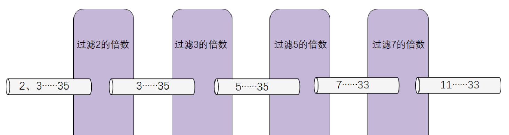

算法正确性证明：

1. 由于我们每次把第一个传到的数直接输出,所以证明第一个数是素数[即结果的素数中，不能有非素数]
2. 所有的素数，总在某一次传递的时候，是在第一个数(看作素数)   [即所有的素数,一定在结果中]

证明:

1. 证明1.

   朴素:第一次我们进来的是2，这确实是素数.然后我们用2过滤完后，剩下的一定没有2的倍数了[3,5,7,9...]，然后传到下一个piep,我们接收到3，这确实是素数，因为我们用2过滤过了。然后这组，我们用3过滤，过滤完传给下一个pipe，此时是[5,7,11,...]。我们接收到5，这确实是素数，因为5不是2的倍数(过滤),5也不是3的倍数(过滤)，5也不是4的倍数(5是4的倍数，那么一定是2的倍数..)，...，ok，我们朴素的可以知道这个结论是正确的.

   数学归纳法:证明某次传进来的所有数,一定都不是[2,a1-1]的某个数的倍数

   初始条件,一开始传进来的是[2,3,4,...,35],第一个数为2,所有数当然一定都不是[2~2-a]的倍数(因为这个区间是NULL)

   > 注意，这里的a1,a2,a3是按顺序的，也就是说，a1是最小的那个

   如果某次收到的是[a1,a2,a3...],这里的[a1,a2,a3...]都不是[2~a1-1]的某个数的倍数，而且这次过滤后的结果为[b1,b2,b3...]传给下一个，那么我们需要证明,[b1,b2,b3...]都不是[2~b1-1]的某个数的倍数，ok，开始证明:

   我们简称A集合和B集合吧.因为B集合是A集合的子集,由于A集合都不是[2~a1-1]的某个数的倍数,所以我们只需要证明，所有B集合的都不是[a1~b1-1]的某个数的倍数，这样就可以证出B集合一定不是[2~b1-1]的某个数的倍数.  反证法:假设B集合的某个数Bk是[a1~b1-1]的某个数k的倍数,由于这个k不在B集合中，所以说明，在前面的筛选中已经把k筛选掉了，也就是说，k一定是[2~a1]的某个数的倍数,所以，如果对于k成立，那对于[2~a1]的某个数也成立，由于我们已知B集合不是[2~a1-1]的某个数的倍数，且也不是a1的倍数,所以不是[2~a1]的某个数的倍数，所以矛盾，证得.

   

2. 假设有一个素数k，他不出现在结果中 等价于 他被某次筛选掉了，认为是那次a1的倍数。 而这样一定不成立，k不可能是某个数a1的倍数，所以得证.


每个进程都是筛完合数然后将筛完的数一股脑传给下一级进程的感觉，其实不然，这样一方面需要多一个缓冲区来存储筛完的数，另一方面也不方便并行。实际上应该更好地利用管道的队列性质。对于每个进程，从输入管道得到第一个质数后就创建子进程，然后对输入管道剩下的数进行筛选，如果合法就放入输出管道，这样多个进程同时操作，也不用缓冲区了。子进程中创建子进程这种操作很难直接表示，需要用到递归思想。

```c
#include "../kernel/types.h"
#include "user.h"

void f(int pp) {
    int prime;
    if (read(pp, (char *)&prime, 4) != 0) {
        printf("prime %d\n", prime);
        int p[2]; pipe(p);
        if (fork() == 0) {
            close(p[1]); f(p[0]);
        } else {
            int t;
            while (read(pp, (char *)&t, 4) != 0) {
                if (t % prime != 0) write(p[1], (char *)&t, 4);
            }
            close(p[1]); close(p[0]); close(pp); wait(0);
        }
    } else close(pp);
}
int main() {
    int i, p[2]; pipe(p);
    if (fork() == 0) {
        close(p[1]); f(p[0]);
    } else {
        for (i = 2; i < 36; i++) write(p[1], (char *)&i, 4);
        close(p[1]); close(p[0]); wait(0);
    }
    exit(0);
}      
```

* 注意每次fork以后会给当前的管道添加一个引用，而想要关闭一个管道必须将它的所有引用都关闭才行。因此每次在fork之后关闭不用的管道是一个好习惯，防止忘关导致其他进程读不到eof。  我们通过测试得知，如果同一个文件，这个进程A在read的时候，如果此时有任何一个进程，包括进程A，如果打开了这个文件的写pipe而没有关闭，那么read的时候，有len长度的数据就直接得到数据返回，如果不够len长度，就会一直等待，直到所有的写端都关闭了为止。所以我们可以看到，我们在传递完后，一定要将p[1]关闭，这样子进程才不会一直阻塞在read上，我们的子进程也是，要将fork来的p[1]关闭.
* 总的来说，我们的流程就是，父进程发送筛选后的结果到pipe，子进程接收这个pipe，然后fork，fork的父进程依然发送筛选后的结果到pipe，子进程接收这个pipe，然后fork...

结果:

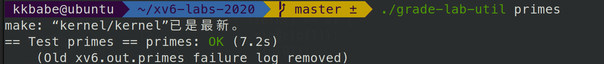

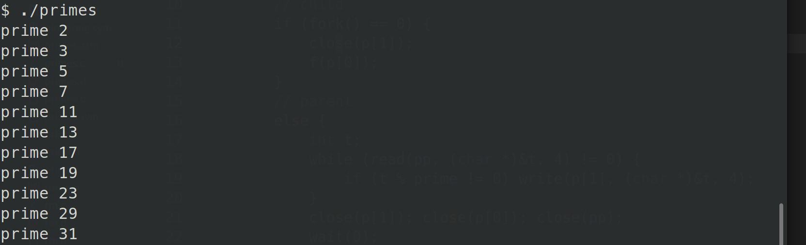


## find

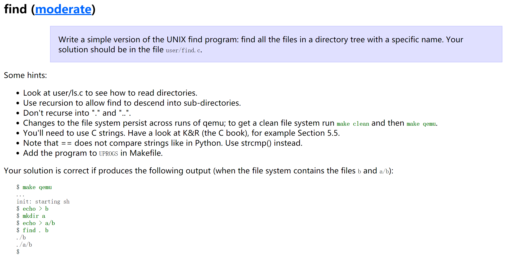

find功能是在目录中匹配文件名，实现思路是递归搜索整个目录树。使用open()打开当前fd，用`fstat()`判断fd的type，如果是文件，则与要找的文件名进行匹配；如果是目录，则循环read()到dirent结构，得到其子文件/目录名，拼接得到当前路径后进入递归调用。注意对于子目录中的`.`和`..`不要进行递归,防止死循环.


实现一个find函数的功能，指导书推荐我们看一下**user/ls.c**的实现，大部分代码和**ls.c**是类似的，首先先清楚一下fstat的功能，输入一个文件描述符得到相关信息，xv6中定义的文件信息结构

```c
struct stat {
  int dev;     // 文件系统设备号
  uint ino;    // Inode 值
  short type;  // 文件类型
  short nlink; // 文件被链接数
  uint64 size; // 文件大小
};
```


`find.c`——基本上套用ls.c里的内容。

```c
#include "../kernel/types.h"
#include "../kernel/stat.h"
#include "../user/user.h"
#include "../kernel/fs.h"

const char *now = ".", *par = "..";

char* fmtname(char *path) {
    char *p;
    for(p = path + strlen(path); p >= path && *p != '/'; p--);
    p++;
    return p;
}

void find(char *path, char *pattern) {
    char buf[128], *p;
    int fd;
    struct dirent de;
    struct stat st;

    if((fd = open(path, 0)) < 0){
        printf("find: cannot open %s\n", path);
        return;
    }

    if(fstat(fd, &st) < 0){
        printf("find: cannot stat %s\n", path);
        close(fd);
        return;
    }

    switch(st.type){
        case T_FILE:
            if (strcmp(pattern, fmtname(path)) == 0) printf("%s\n", path);
            break;

        case T_DIR:
            if(strlen(path) + 1 + DIRSIZ + 1 > sizeof buf){
                printf("ls: path too long\n");
                break;
            }
            strcpy(buf, path);
            p = buf + strlen(buf);
            *p++ = '/';
            while(read(fd, &de, sizeof(de)) == sizeof(de)){
                if(de.inum == 0) continue;
                if (strcmp(de.name, now) == 0 || strcmp(de.name, par) == 0) continue;
                memmove(p, de.name, DIRSIZ);
                p[DIRSIZ] = 0;
                find(buf, pattern);
            }
            break;
    }
    close(fd);
}

int main(int argc, char *argv[]) {
    if (argc < 3) {
        printf("find: argument is less than 2\n");
        exit(0);
    }
    find(argv[1], argv[2]); exit(0);
}
```

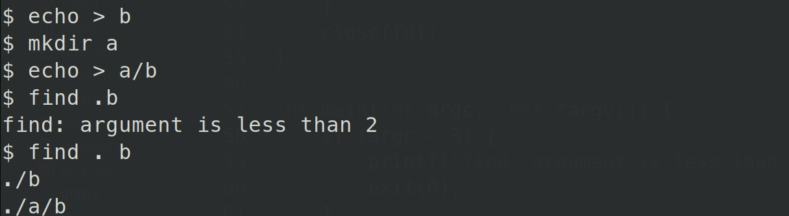

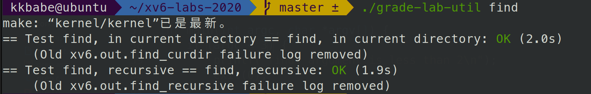


## xargs

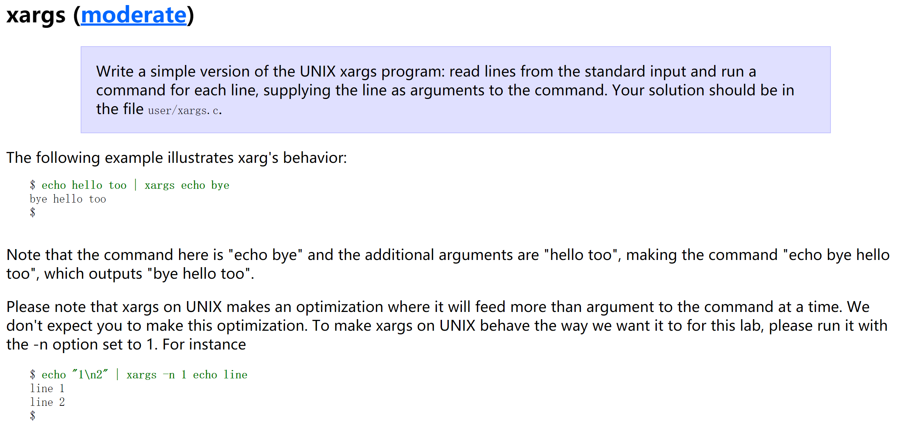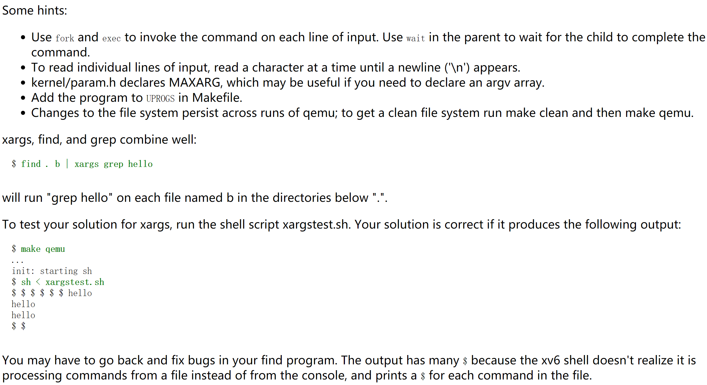

xargs的功能是将标准输入转为程序的命令行参数。可配合管道使用，让原本无法接收标准输入的命令可以使用标准输入作为参数。

根据lab中的使用例子可以看出，xv6的xargs每次回车都会执行一次命令并输出结果，直到ctrl+d时结束；而linux中的实现则是一直接收输入，收到ctrl+d时才执行命令并输出结果。

思路是使用两层循环读取标准输入：

- 内层循环依次读取每一个字符，根据空格进行参数分割，将参数字符串存入二维数组中，当读取到'\n'时，退出当前循环；当接收到ctrl+d（read返回的长度<0）时退出程序。
- 外层循环对每一行输入`fork()`出子进程，调用`exec()`执行命令。注意exec接收的二维参数数组argv，第一个参数argv[0]必须是该命令本身，最后一个参数argv[size-1]必须为0，否则将执行失败。


```c
#include "../kernel/types.h"
#include "../kernel/param.h"
#include "../user/user.h"

#define STDIN_FILENO 0
#define MAXLINE 1024

int main(int argc, char *argv[])
{
    char line[MAXLINE];
    char* params[MAXARG];
    int n, args_index = 0;
    int i;

    char* cmd = argv[1];
    for (i = 1; i < argc; i++) params[args_index++] = argv[i];

    while ((n = read(STDIN_FILENO, line, MAXLINE)) > 0)
    {
        if (fork() == 0) // child process
        {
            char *arg = (char*) malloc(sizeof(line));
            int index = 0;
            for (i = 0; i < n; i++)
            {
                if (line[i] == ' ' || line[i] == '\n')
                {
                    arg[index] = 0;
                    params[args_index++] = arg;
                    index = 0;
                    arg = (char*) malloc(sizeof(line));
                }
                else arg[index++] = line[i];
            }
            arg[index] = 0;
            params[args_index] = 0;
            exec(cmd, params);
        }
        else wait((int*)0);
    }
    exit(0);
}
```


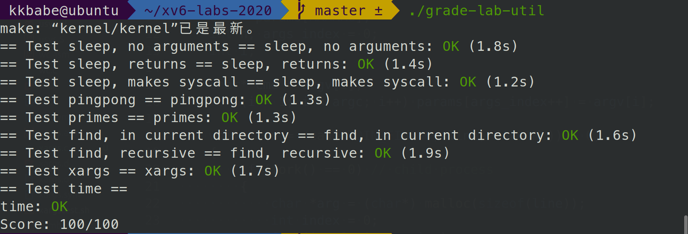

