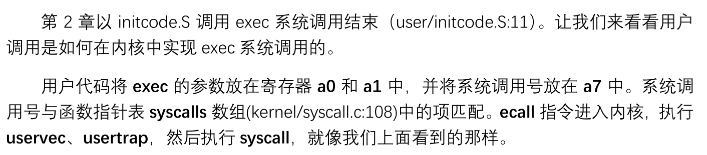
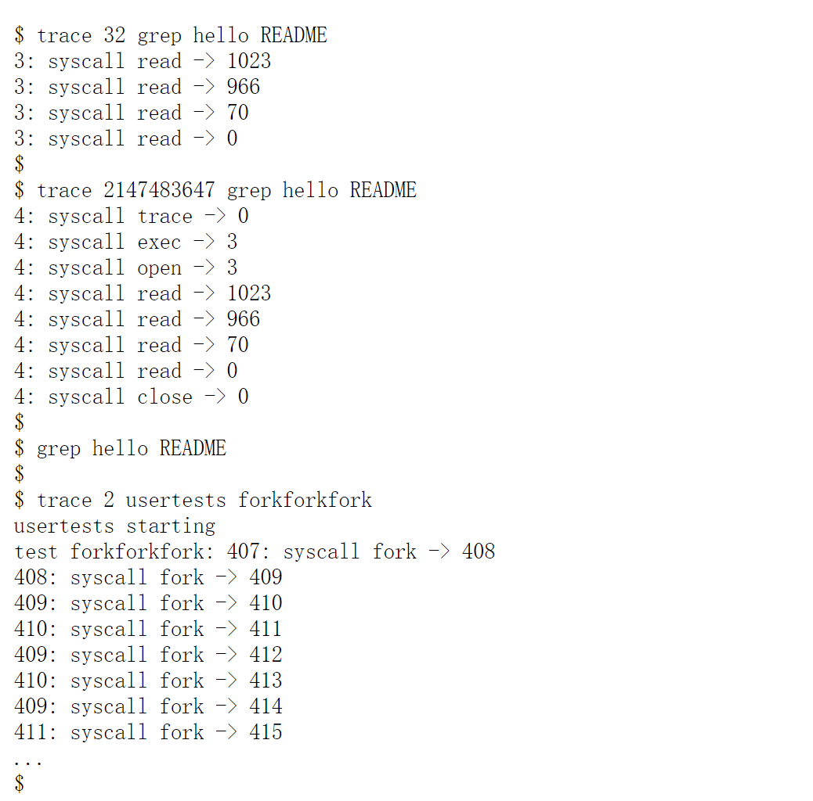
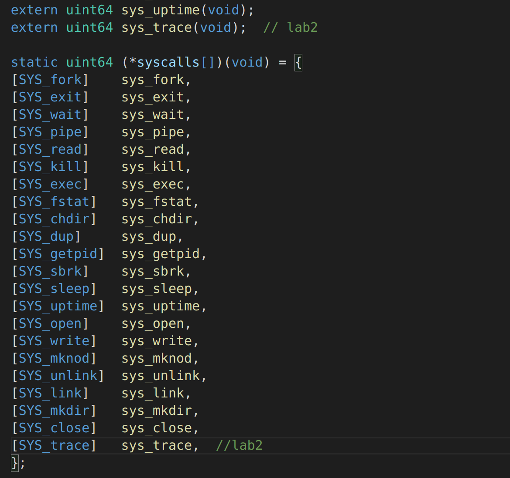

[Lab: System calls (mit.edu)](https://pdos.csail.mit.edu/6.828/2020/labs/syscall.html)


handout告诉我们先去看xv6 book的第二章，以及第四章的4.3和4.4节，以及一些源代码：

* syscall的user-space code：user/user.h	user/usys.pl
* syscall的kernel-space code：kernel/syscall.h   kernel/syscall.c
* 进程相关的代码：kernel/proc.h   kernel/proc.c


# lab前学习

## 4.3 Code: Calling system calls




`syscall.c:`

```c
static uint64 (*syscalls[])(void) = {	
//syscalls数组,syscalls[1]=sys_fork,syscall[2]=sys_exit ...
[SYS_fork]    sys_fork,
[SYS_exit]    sys_exit,
[SYS_wait]    sys_wait,
[SYS_pipe]    sys_pipe,
[SYS_read]    sys_read,
[SYS_kill]    sys_kill,
[SYS_exec]    sys_exec,
[SYS_fstat]   sys_fstat,
[SYS_chdir]   sys_chdir,
[SYS_dup]     sys_dup,
[SYS_getpid]  sys_getpid,
[SYS_sbrk]    sys_sbrk,
[SYS_sleep]   sys_sleep,
[SYS_uptime]  sys_uptime,
[SYS_open]    sys_open,
[SYS_write]   sys_write,
[SYS_mknod]   sys_mknod,
[SYS_unlink]  sys_unlink,
[SYS_link]    sys_link,
[SYS_mkdir]   sys_mkdir,
[SYS_close]   sys_close,
};

void
syscall(void)//从 trapframe中的 a7 中得到系统调用号，并其作为索引在 syscalls 查找相应函数
{
  int num;
  struct proc *p = myproc();	//得到当前的进程数据结构proc

  num = p->trapframe->a7;	//从a7中得到系统调用号num
  if(num > 0 && num < NELEM(syscalls) && syscalls[num]) {
    p->trapframe->a0 = syscalls[num]();	//调用syscalls[num]的这个函数,返回值记录在a0
  } else {
    printf("%d %s: unknown sys call %d\n",
            p->pid, p->name, num);
    p->trapframe->a0 = -1;
  }
}
```


调用完execve后，实际上就是从这个syscall函数返回，我们的syscall函数将a0置为调用完syscalls[nums]函数后的返回值.然后会将a0的值返回给用户.

这里的syscalls数组是C语言的一个特别写法，这里是建立了一个从下标如[SYS_fork]即下标1映射到一个函数如sys_fork(void)

[(1条消息) C语言数组带下标赋值_lala0903的博客-CSDN博客](https://blog.csdn.net/lala0903/article/details/109758594)


## 4.4 Code: System call arguments


我们的参数是放在寄存器中的，在真正的系统调用函数sys_exec中，从这些指定的寄存器中读数据.

```c
//syscall.c

static uint64
argraw(int n)
{
  struct proc *p = myproc();
  switch (n) {
  case 0:
    return p->trapframe->a0;
  case 1:
    return p->trapframe->a1;
  case 2:
    return p->trapframe->a2;
  case 3:
    return p->trapframe->a3;
  case 4:
    return p->trapframe->a4;
  case 5:
    return p->trapframe->a5;
  }
  panic("argraw");
  return -1;
}

// Fetch the nth 32-bit system call argument.
int
argint(int n, int *ip)	//获取整数
{
  *ip = argraw(n);
  return 0;
}

// Retrieve an argument as a pointer.
// Doesn't check for legality, since
// copyin/copyout will do that.
int
argaddr(int n, uint64 *ip)	//获取指针
{
  *ip = argraw(n);
  return 0;
}

// Fetch the nth word-sized system call argument as a file descriptor
// and return both the descriptor and the corresponding struct file.
static int
argfd(int n, int *pfd, struct file **pf)	//获取文件描述符
{
  int fd;
  struct file *f;

  if(argint(n, &fd) < 0)
    return -1;
  if(fd < 0 || fd >= NOFILE || (f=myproc()->ofile[fd]) == 0)
    return -1;
  if(pfd)
    *pfd = fd;
  if(pf)
    *pf = f;
  return 0;
}
```

可以看到，我们会用argraw(n)来获取an寄存器的数据,返回一个unsigned long(uint64).

利用这个argraw，我们可以写argint,argaddr,trapframe来获取各种类型的参数

所以总的来说，我们的用户函数调用后，去执行syscall函数,从a7寄存器取出syscall编号，根据syscalls数组找到这个编号对应的函数，去调用他.而且我们这个调用不用传参数了，参数是在对应的函数中再去用argraw啥的从规定的寄存器中去读，比如我们可以来看一下sys_exec()函数:

```c
// sysfile.c

uint64
sys_exec(void)
{
  char path[MAXPATH], *argv[MAXARG];
  int i;
  uint64 uargv, uarg;

  if(argstr(0, path, MAXPATH) < 0 || argaddr(1, &uargv) < 0){	//把寄存器a0的字符串放到path[]，把寄存器a1的地址放到uargv变量
    return -1;
  }
  
    ....省略一系列过程....**************************
}
```

可以看到，我们确实是用argstr去读了a0寄存器，读为一个字符串，用argaddr去读了一个a1寄存器，读为一个uin64变量，验证了我们刚才所说的。这样的设计有一个显而易见的好处，我们在外面只需要用用一个syscalls数组记录系统调用号到这个函数地址的映射，这个函数统一设计为无参，这样就简洁很多.


> wow!!!xv6的内核页表映射和用户页映射不一样,所以内核不能用普通指令从用户提供的地址加载或存储，所以，如何把指针对应的数据(如字符串)传给内核态呢？


```c
// Fetch the nul-terminated string at addr from the current process.
// Returns length of string, not including nul, or -1 for error.
int
fetchstr(uint64 addr, char *buf, int max)
{
  struct proc *p = myproc();
  /*copyinstr:利用用户页表pagetable将addr地址的字符串传到我们内核栈的buf[]数组,并指定了复制字节数max*/
  int err = copyinstr(p->pagetable, buf, addr, max);
  if(err < 0)
    return err;
  return strlen(buf);
}

// Copy a null-terminated string from user to kernel.
// Copy bytes to dst from virtual address srcva in a given page table,
// until a '\0', or max.
// Return 0 on success, -1 on error.
int
copyinstr(pagetable_t pagetable, char *dst, uint64 srcva, uint64 max)
{
  uint64 n, va0, pa0;
  int got_null = 0;

  while(got_null == 0 && max > 0){
    va0 = PGROUNDDOWN(srcva);
    pa0 = walkaddr(pagetable, va0);	//根据页表pagetable将虚拟地址v0转化成物理地址
    if(pa0 == 0)
      return -1;
    n = PGSIZE - (srcva - va0);
    if(n > max)
      n = max;

    char *p = (char *) (pa0 + (srcva - va0));
    while(n > 0){
      if(*p == '\0'){
        *dst = '\0';
        got_null = 1;
        break;
      } else {
        *dst = *p;
      }
      --n;
      --max;
      p++;
      dst++;
    }

    srcva = va0 + PGSIZE;
  }
  if(got_null){
    return 0;
  } else {
    return -1;
  }
}

// Look up a virtual address, return the physical address,
// or 0 if not mapped.
// Can only be used to look up user pages.
uint64
walkaddr(pagetable_t pagetable, uint64 va)
{
  pte_t *pte;
  uint64 pa;

  if(va >= MAXVA)
    return 0;

  pte = walk(pagetable, va, 0);
  if(pte == 0)
    return 0;
  if((*pte & PTE_V) == 0)
    return 0;
  if((*pte & PTE_U) == 0)
    return 0;
  pa = PTE2PA(*pte);
  return pa;
}
```

所以总的来说:

```c
int fetchstr(uint64 addr, char *buf, int max);	//将用户空间的addr[max]传给内核空间的buf[]
	在fetchstr中会调用copyinstr将虚拟地址转换成物理地址,然后用物理地址去将数据读到buf[]
int copyinstr(pagetable_t pagetable, char *dst, uint64 srcva, uint64 max);	//根据页表pagetable,将虚拟地址srcva的字符串传给dst[]数组,并最大为max
	在copyinstr中会调用walkaddr，这是真正将虚拟地址转换成物理地址的函数
uint64 walkaddr(pagetable_t pagetable, uint64 va);	//根据pagetable将虚拟地址va变成物理地址pa
```


## proc.h

### struct context 上下文

```c
// Saved registers for kernel context switches.
struct context {
  uint64 ra;
  uint64 sp;

  // callee-saved(被调用者保存)
  uint64 s0;
  uint64 s1;
  uint64 s2;
  uint64 s3;
  uint64 s4;
  uint64 s5;
  uint64 s6;
  uint64 s7;
  uint64 s8;
  uint64 s9;
  uint64 s10;
  uint64 s11;
};
```

可以看到,context中记录着上下文.当我们进程切换到这个进程时，我们需要保存被调用者保存的寄存器，因为调用者保存的寄存器是可以破坏掉的，但是被调用者保存的寄存器不能去改变.


### struct cpu

```c
// Per-CPU state.
struct cpu {
  struct proc *proc;          // The process running on this cpu, or null.【进程】
  struct context context;     // swtch() here to enter scheduler().【上下文】
  int noff;                   // Depth of push_off() nesting.
  int intena;                 // Were interrupts enabled before push_off()?
};

extern struct cpu cpus[NCPU];
```


### struct trapframe(trap时需要的寄存器)

```c
// per-process data for the trap handling code in trampoline.S.
// sits in a page by itself just under the trampoline page in the
// user page table. not specially mapped in the kernel page table.
// the sscratch register points here.
// uservec in trampoline.S saves user registers in the trapframe,
// then initializes registers from the trapframe's
// kernel_sp, kernel_hartid, kernel_satp, and jumps to kernel_trap.
// usertrapret() and userret in trampoline.S set up
// the trapframe's kernel_*, restore user registers from the
// trapframe, switch to the user page table, and enter user space.
// the trapframe includes callee-saved user registers like s0-s11 because the
// return-to-user path via usertrapret() doesn't return through
// the entire kernel call stack.
struct trapframe {
  /*   0 */ uint64 kernel_satp;   // kernel page table
  /*   8 */ uint64 kernel_sp;     // top of process's kernel stack
  /*  16 */ uint64 kernel_trap;   // usertrap()
  /*  24 */ uint64 epc;           // saved user program counter
  /*  32 */ uint64 kernel_hartid; // saved kernel tp
  /*  40 */ uint64 ra;
  /*  48 */ uint64 sp;
  /*  56 */ uint64 gp;
  /*  64 */ uint64 tp;
  /*  72 */ uint64 t0;
  /*  80 */ uint64 t1;
  /*  88 */ uint64 t2;
  /*  96 */ uint64 s0;
  /* 104 */ uint64 s1;
  /* 112 */ uint64 a0;
  /* 120 */ uint64 a1;
  /* 128 */ uint64 a2;
  /* 136 */ uint64 a3;
  /* 144 */ uint64 a4;
  /* 152 */ uint64 a5;
  /* 160 */ uint64 a6;
  /* 168 */ uint64 a7;
  /* 176 */ uint64 s2;
  /* 184 */ uint64 s3;
  /* 192 */ uint64 s4;
  /* 200 */ uint64 s5;
  /* 208 */ uint64 s6;
  /* 216 */ uint64 s7;
  /* 224 */ uint64 s8;
  /* 232 */ uint64 s9;
  /* 240 */ uint64 s10;
  /* 248 */ uint64 s11;
  /* 256 */ uint64 t3;
  /* 264 */ uint64 t4;
  /* 272 */ uint64 t5;
  /* 280 */ uint64 t6;
};

```


### procstate 进程执行状态

```c
enum procstate { UNUSED, SLEEPING, RUNNABLE, RUNNING, ZOMBIE };
```


### struct proc 进程信息

```c

// Per-process state
struct proc {
  struct spinlock lock;	//自旋锁

  // p->lock must be held when using these:
  enum procstate state;        // Process state【进程状态】
  struct proc *parent;         // Parent process【父进程proc指针】
  void *chan;                  // If non-zero, sleeping on chan
  int killed;                  // If non-zero, have been killed
  int xstate;                  // Exit status to be returned to parent's wait【返回状态,记录这个用来在parent wait时返回给父进程他的终止状态】
  int pid;                     // Process ID	

  // these are private to the process, so p->lock need not be held.
  uint64 kstack;               // Virtual address of kernel stack【内核栈地址】
  uint64 sz;                   // Size of process memory (bytes) 【进程内存大小】
  pagetable_t pagetable;       // User page table	【页表】
  struct trapframe *trapframe; // data page for trampoline.S	
  struct context context;      // swtch() here to run process	
  struct file *ofile[NOFILE];  // Open files	【打开文件表】
  struct inode *cwd;           // Current directory	
  char name[16];               // Process name (debugging)	【进程名字】
};
```


## 最后借一篇文章来最后总结

[MIT6.S081/6.828 实验1：Lab Unix Utilities - 小黑电脑 (xiaoheidiannao.com)](https://www.xiaoheidiannao.com/11188.html)这篇文章比较好的介绍了xv6系统调用流程.如下.

Lab中对system call的使用很简单，看起来和普通函数调用并没有什么区别，但实际上的调用流程是较为复杂的。我们很容易产生一些疑问：系统调用的整个生命周期具体是什么样的？用户进程和内核进程之间是如何切换上下文的？系统调用的函数名、参数和返回值是如何在用户进程和内核进程之间传递的？

### 1.用户态调用

在用户空间，所有system call的函数声明写在`user.h`中，调用后会进入`usys.S`执行汇编指令：将对应的系统调用号（system call number）置于寄存器a7中，并执行ecall指令进行系统调用，其中函数参数存在a0~a5这6个寄存器中。ecall指令将触发软中断，cpu会暂停对用户程序的执行，转而执行内核的中断处理逻辑，陷入（trap）内核态。

`user/user.h`中声明了所有的系统调用包装函数,以及ulibc的库函数

```c

//user/user.h

struct stat;
struct rtcdate;

// system calls
int fork(void);
int exit(int) __attribute__((noreturn));
int wait(int*);
int pipe(int*);
int write(int, const void*, int);
int read(int, void*, int);
int close(int);
int kill(int);
int exec(char*, char**);
int open(const char*, int);
int mknod(const char*, short, short);
int unlink(const char*);
int fstat(int fd, struct stat*);
int link(const char*, const char*);
int mkdir(const char*);
int chdir(const char*);
int dup(int);
int getpid(void);
char* sbrk(int);
int sleep(int);
int uptime(void);

// ulib.c
int stat(const char*, struct stat*);
char* strcpy(char*, const char*);
void *memmove(void*, const void*, int);
char* strchr(const char*, char c);
int strcmp(const char*, const char*);
void fprintf(int, const char*, ...);
void printf(const char*, ...);
char* gets(char*, int max);
uint strlen(const char*);
void* memset(void*, int, uint);
void* malloc(uint);
void free(void*);
int atoi(const char*);
int memcmp(const void *, const void *, uint);
void *memcpy(void *, const void *, uint);

```


用户调用这些函数后，会进入`usys.S`中执行汇编指令，将对应的系统调用号（system call number）置于寄存器a7中，并执行ecall指令进行系统调用，其中函数参数存在a0~a5这6个寄存器中，并执行ecall指令进行系统调用，其中函数参数存在a0~a5这6个寄存器中。ecall指令将触发软中断，cpu会暂停对用户程序的执行，转而执行内核的中断处理逻辑，陷入（trap）内核态。

```assembly
# user/usys.S
# generated by usys.pl - do not edit
#include "kernel/syscall.h"
.global fork
fork:	#fork函数
 li a7, SYS_fork	#li:Load Immediately立即数加载,把SYS_fork(1)加载到a7中
 ecall	#ecall:Environment Call 通过引发环境调用异常来请求执行环境
 ret
.global exit
exit:
 li a7, SYS_exit
 ecall
 ret
.global wait
wait:
 li a7, SYS_wait
 ecall
 ret
.global pipe
pipe:
 li a7, SYS_pipe
 ecall
 ret
.global read
read:
 li a7, SYS_read
 ecall
 ret
.global write
write:
 li a7, SYS_write
 ecall
 ret
.global close
close:
 li a7, SYS_close
 ecall
 ret
.global kill
kill:
 li a7, SYS_kill
 ecall
 ret
.global exec
exec:
 li a7, SYS_exec
 ecall
 ret
.global open
open:
 li a7, SYS_open
 ecall
 ret
.global mknod
mknod:
 li a7, SYS_mknod
 ecall
 ret
.global unlink
unlink:
 li a7, SYS_unlink
 ecall
 ret
.global fstat
fstat:
 li a7, SYS_fstat
 ecall
 ret
.global link
link:
 li a7, SYS_link
 ecall
 ret
.global mkdir
mkdir:
 li a7, SYS_mkdir
 ecall
 ret
.global chdir
chdir:
 li a7, SYS_chdir
 ecall
 ret
.global dup
dup:
 li a7, SYS_dup
 ecall
 ret
.global getpid
getpid:
 li a7, SYS_getpid
 ecall
 ret
.global sbrk
sbrk:
 li a7, SYS_sbrk
 ecall
 ret
.global sleep
sleep:
 li a7, SYS_sleep
 ecall
 ret
.global uptime
uptime:
 li a7, SYS_uptime
 ecall
 ret

```

看上去代码很长，其实所做的就只有一件事，对于任意一个系统函数如fork,会将SYS_fork，即1加载到a7寄存器,然后ecall触发环境异常,去执行异常处理程序之后，ret给调用者.

### 2.上下文切换

中断处理在`kernel/trampoline.S`中，首先进行上下文的切换，将user进程在寄存器中的数据save到内存中（保护现场），并restore（恢复）kernel的寄存器数据。内核中会维护一个进程数组（最多容纳64个进程），存储每个进程的状态信息，proc结构体定义在proc.h，这也是xv6对PCB（Process Control Block）的实现。用户程序的寄存器数据将被暂时保存到`proc->trapframe`结构中。


### 3.内核态执行

完成进程切换后，调用`trap.c/usertrap()`，接着进入`syscall.c/syscall()`，在该方法中根据system call number拿到数组中的函数指针，执行系统调用函数。函数参数从用户进程的`trapframe`结构中获取(a0~a5)，函数执行的结果则存储于trapframe的a0字段中。完成调用后同样需要进程切换，先save内核寄存器到`trapframe->kernel_*`，再将trapframe中暂存的user进程数据restore到寄存器，重新回到用户空间，cpu从中断处继续执行，从寄存器a0中拿到函数返回值。

至此，系统调用完成，共经历了两次进程上下文切换：用户进程 -> 内核进程 -> 用户进程，同时伴随着两次CPU工作状态的切换：用户态 -> 内核态 -> 用户态。


[MIT-6.S081-2020实验（xv6-riscv64）二：syscall - YuanZiming - 博客园 (cnblogs.com)](https://www.cnblogs.com/YuanZiming/p/14218997.html)

这篇文章我觉得质量更好，如下:

实验二主要涉及对系统函数调用过程的理解以及尝试自己手动添加系统调用。首先需要大致了解一下xv6系统调用的过程，这里以fork为例：


OK，进入今天的lab.

# lab

## 1.trace


In this assignment you will add a system call tracing feature that may help you when debugging later labs. You’ll create a new `trace` system call that will control tracing. It should take one argument, an integer “mask”, whose bits specify which system calls to trace. For example, to trace the fork system call, a program calls `trace(1 << SYS_fork)`, where `SYS_fork` is a syscall number from `kernel/syscall.h`. You have to modify the xv6 kernel to print out a line when each system call is about to return, if the system call’s number is set in the mask. The line should contain the process id, the name of the system call and the return value; you don’t need to print the system call arguments. The `trace` system call should enable tracing for the process that calls it and any children that it subsequently forks, but should not affect other processes.

> 在这个作业中，你将添加一个系统调用跟踪`tracing`功能，这可能会在以后的实验调试中对你有所帮助。你将创建一个新的跟踪`trace`系统调用来控制跟踪。它应该**接受一个参数**，即一个整数 "掩码"，其位数指定要**跟踪哪些系统调用**。例如，为了跟踪fork系统调用，程序会调用trace(1 << SYS_fork)，其中SYS_fork是来自kernel/syscall.h的系统调用编号。你必须修改xv6 kernel，以便在每个系统调用即将返回时打印出一行，如果系统调用的编号被设置在掩码中的话。这一行应该包含进程ID、系统调用的名称和返回值；你不需要打印系统调用的参数。追踪系统调用应该对调用它的进程和它随后分叉的任何子进程进行追踪，但不应该影响其他进程。




In the first example above, trace invokes grep tracing just the read system call. The 32 is `1<<SYS_read`. In the second example, trace runs grep while tracing all system calls; the 2147583647 has all 31 low bits set. In the third example, the program isn't traced, so no trace output is printed. In the fourth example, the fork system calls of all the descendants of the `forkforkfork` test in `usertests` are being traced. Your solution is correct if your program behaves as shown above (though the process IDs may be different).

> * 在上面的第一个例子中，trace调用grep只追踪read系统调用。32位是`1<<SYS_read`。  
> * 在第二个例子中，trace运行grep，同时追踪所有的系统调用；2147583647的31位低位全部被设置。
> * 在第三个例子中，程序没有被跟踪，所以没有打印跟踪输出。
> * 在第四个例子中，正在追踪`usertests`中`forkforkfork`测试的所有子代的fork系统调用。如果你的程序表现得如上所示，你的解决方案是正确的（尽管进程ID可能不同）。


**Some hints：**

* Add `$U/_trace` to UPROGS in Makefile


* Run **`make qemu`** and you will see that the compiler cannot compile `user/trace.c`

  本来就已经有一个trace.c在实验框架写好了

  ```c
  #include "kernel/param.h"
  #include "kernel/types.h"
  #include "kernel/stat.h"
  #include "user/user.h"
  
  int
  main(int argc, char *argv[])
  {
    int i;
    char *nargv[MAXARG];
  
    if(argc < 3 || (argv[1][0] < '0' || argv[1][0] > '9')){
      fprintf(2, "Usage: %s mask command\n", argv[0]);
      exit(1);
    }
  
    if (trace(atoi(argv[1])) < 0) {
      fprintf(2, "%s: trace failed\n", argv[0]);
      exit(1);
    }
    
    for(i = 2; i < argc && i < MAXARG; i++){
      nargv[i-2] = argv[i];
    }
    exec(nargv[0], nargv);
    exit(0);
  }
  
  ```

  


This is because the user-space stubs for the system call don’t exist yet（因为没有trace函数）:

* add a prototype(原型) for the system call to `user/user.h` , a stub to `user/usys.pl`, a syscall number to `kernel/syscall.h` (在user/user.h添加函数原型，在user/usys.pl添加存档,在kernel/syscall.h中添加syscall number)

  

* The Makefile invokes the perl script `user/usys.pl`, which produces `user/usys.S`, the actual system call stubs, which use the RISC-V ecall instruction to transition to the kernel.（Makefile调用perl脚本user/usys.pl，产生user/usys.S，这是实际的系统调用存根，它使用RISC-V的ecall指令切换到内核。）

  usys.S如下图:

  

  可以看到，这是真正的函数库，我们的fork函数，exit函数，都通过他来将编号放在a7，然后ecall调用内核的syscall代码.

  将`SYS_trace`这个syscall number放入寄存器`a7`, 然后`ecall`进入kernel mode

  ```assembly
  .global trace
  trace:
   li a7, SYS_trace
   ecall
   ret
  ```

  Once you fix the compilation issues(修复编译问题), run **trace 32 grep hello README**; it will fail because you haven’t implemented the system call in the kernel yet.(还没有在kernel中实现sys_trace)

* Add a `sys_trace()` function in `kernel/sysproc.c` that implements the new system call by remembering its argument in a new variable in the proc structure (see `kernel/proc.h`).[在kernel/sysproc.c中增加一个sys_trace()函数，通过在proc结构中的一个新变量mask（见kernel/proc.h）记住其参数来实现新的系统调用。]

  在 `kernel/proc.h` 中的proc结构体中新增一个mask成员变量。

  

* The functions to retrieve(检索) system call arguments from user space are in `kernel/syscall.c`, and you can see examples of their use in `kernel/sysproc.c`.(从用户空间检索系统调用参数的函数在kernel/syscall.c中，你可以在kernel/sysproc.c中看到它们的使用例子。)

  在 `syscall.c` 中声明 `sys_trace` 函数，然后在 `syscalls` 这个函数指针数组中增加 `sys_trace` 。

  

  实现`sys_trace`函数(在kernel/sysproc.c中)，首先通过`argint`获取mask参数，然后将mask参数赋给proc

  ```c
  uint
  sys_trace(void) {
    int trace_mask;
    if(argint(0, &trace_mask) < 0) {  //从a0寄存器得到trace_mask
      return -1;
    }
    struct proc* p = myproc();
    p->mask = trace_mask; //修改proc->mask = 本地的trace_mask
    return 0;
  }
  ```

  

* Modify `fork()` (see `kernel/proc.c`) to copy the trace mask from the parent to the child process.[修改fork()(见kernel/proc.c)，将<u>跟踪掩码从父进程复制到子进程</u>。]

  在做lab之余，我们先仔细看看fork函数怎么实现的也是很有必要的:

  ```c
  // Create a new process, copying the parent.
  // Sets up child kernel stack to return as if from fork() system call.
  int
  fork(void)
  {
    int i, pid;
    struct proc *np;  //new process
    struct proc *p = myproc();  // now process
  
    // Allocate process.
    if((np = allocproc()) == 0){
      return -1;
    }
  
    // Copy user memory from parent to child.
    if(uvmcopy(p->pagetable, np->pagetable, p->sz) < 0){  //将p进程的页表复制到np进程的页表
      freeproc(np);
      release(&np->lock);
      return -1;
    }
    np->sz = p->sz; // 修改np的sz
  
    np->parent = p; // np的parent=p
  
    // copy saved user registers.
    *(np->trapframe) = *(p->trapframe);
  
    // Cause fork to return 0 in the child.
    np->trapframe->a0 = 0;  //np->trapframe->a0置0,就是子进程返回0
  
    // increment reference counts on open file descriptors.
    for(i = 0; i < NOFILE; i++)
      if(p->ofile[i])
        np->ofile[i] = filedup(p->ofile[i]);
    np->cwd = idup(p->cwd);
  
    safestrcpy(np->name, p->name, sizeof(p->name)); //继承进程名
  
    pid = np->pid;  
  
    np->state = RUNNABLE;
  
    release(&np->lock);
  
    return pid; // 给父进程返回新建进程的pid
  }
  ```

  > 可以看到，fork创建一个新进程(allocproc()),然后将父进程的页表直接复制给子进程(uvmcopy),修改子进程的sz为父进程的sz(内存大小),子进程的parent=p,并把父进程的trapframe复制给子进程(拷贝状态机).然后是，打开文件表的引用加1，并让子进程指向这个打开文件.	并且,将子进程的state变成RUNNABLE.
  >
  > 还有一个重点，fork是如何做到给子进程返回0，给父进程返回子进程的pid呢？实际上，我们fork函数返回的是子进程的pid，这样是显然可以做到给父进程返回子进程的pid的。有趣的是子进程如何返回0，这是将子进程proc->trapframe->a0=0将返回值a0置为0，之后进程调度后，就会将a0返回给子进程的用户.

  下面，我们继续进入实验部分

  在`fork`函数中增加一行copy mask的代码

  ```c
  np->mask = p->mask;//这行是新增的，copy mask
  ```


* Modify the `syscall()` function in `kernel/syscall.c` to print the trace output. You will need to add an array of syscall names to index into.  [修改`kernel/syscall.c`中的`syscall()`函数以打印跟踪输出。你需要添加一个syscall名称的数组作为索引。]

  在`kernel/syscall.c`中增加一个 `syscallnames` 这个数组，方便打印系统调用的名字:

  


​	syscall函数原来为:

```c
void
syscall(void)
{
  int num;
  struct proc *p = myproc();

  num = p->trapframe->a7;	//a7保存系统调用号
  if(num > 0 && num < NELEM(syscalls) && syscalls[num]) {
    p->trapframe->a0 = syscalls[num]();	//a0是调用真正的系统函数syscalls[num]()的返回值
  } else {
    printf("%d %s: unknown sys call %d\n",
            p->pid, p->name, num);
    p->trapframe->a0 = -1;
  }
}

```


我们再此基础上，加上几行代码:


最终的syscall函数是:

```c
void
syscall(void)
{
  int num;
  struct proc *p = myproc();

  num = p->trapframe->a7;
  if(num > 0 && num < NELEM(syscalls) && syscalls[num]) {
    p->trapframe->a0 = syscalls[num]();	// 返回子进程pid
    if((1 << num) & p->mask) {  //1<<syscall_number是题目中mask的规定写法
      printf("%d: syscall %s -> %d\n", p->pid, syscall_names[num], p->trapframe->a0);
    }
  } else {
    printf("%d %s: unknown sys call %d\n",
            p->pid, p->name, num);
    p->trapframe->a0 = -1;
  }
}
```


ok,我们的工作写完了，我们最终来看一下实验提供的user/trace.c:

```c
#include "kernel/param.h"
#include "kernel/types.h"
#include "kernel/stat.h"
#include "user/user.h"

int
main(int argc, char *argv[])
{
  int i;
  char *nargv[MAXARG];

  if(argc < 3 || (argv[1][0] < '0' || argv[1][0] > '9')){
    fprintf(2, "Usage: %s mask command\n", argv[0]);
    exit(1);
  }

  if (trace(atoi(argv[1])) < 0) {	//argv[1]是传入的(1<<syscall_number)的结果
    fprintf(2, "%s: trace failed\n", argv[0]);
    exit(1);
  }
  
  for(i = 2; i < argc && i < MAXARG; i++){	//将argv[2]以后的参数都放到nargv中,去exec
    nargv[i-2] = argv[i];
  }
  exec(nargv[0], nargv);
  exit(0);
}

```

结果:

(SYS_fork=1,故1<<SYS_fork=2)


trace 2 是指定去trace(编号2)，执行这个，转去执行内核的sys_trace函数，将proc的mask变量变成这个编号.

之后，我们去执行从arg[2]开始的参数，也就是usertests forkforkfork


总结一下，hack一个对fork的trace,我们做的给用户提供一个接口trace函数，用来修改这个进程的mask信息.然后，我们之后就会根据这个mask信息，每个系统调用都去检查是否有这个mask，并打印一定的东西.


## 2.Sysinfo


实现一个可以获得当前系统可用进程数和可用内存的函数。In this assignment you will add a system call, `sysinfo`, that collects information about the running system. The system call takes one argument: a pointer to a struct sysinfo (see `kernel/sysinfo.h`). The kernel should fill out the fields of this struct: the freemem field should be set to the number of bytes of free memory, and the nproc field should be set to the number of processes whose state is not UNUSED. We provide a test program `sysinfotest`; you pass this assignment if it prints “sysinfotest: OK”.

在这个作业中，你将添加一个系统调用，`sysinfo`，用来<u>收集运行系统的信息</u>。这个系统调用需要<u>一个参数：一个指向sysinfo结构的指针（见`kernel/sysinfo.h`）</u>。内核应该填写这个结构的字段：<u>freemem字段应该被设置为自由内存的字节数，nproc字段应该被设置为状态不是UNUSED的进程数</u>。我们提供了一个测试程序`sysinfotest`；如果它打印出 "sysinfotest: OK"。


1. 添加$U/_sysinfo
2. 添加函数声明到user.h，添加entry到usys.pl，添加syscall number到syscall.h，然后加入到syscall函数数组中
3. 然后为了添加sys_sysinfo函数到kernel/sysproc.c，这里为了实现需要在kernel/proc.c和kernel/kalloc.c中分别添加函数获取正在使用的进程和可用的内存数，然后记得将添加的函数声明在defs.h
4. 然后实现sys_sysinfo函数，这里需要看一下copyout函数的使用方法(可以参考sys_fstat（kernel / sysfile.c）和filestat（kernel / file.c）)


**kernel/proc.c**

```cpp
int
proc_size()
{
  int i;
  int n = 0;
  for (i = 0; i < NPROC; i++)
  {
    if (proc[i].state != UNUSED) n++;
  }
  return n;
}
```

**kernel/kalloc.c**

```cpp
uint64 
freememory()
{
  struct run* p = kmem.freelist;
  uint64 num = 0;
  while (p)
  {
    num ++;
    p = p->next;
  }
  return num * PGSIZE;
}
```

**kernel/sysproc.c**

```cpp
uint64
sys_sysinfo(void)
{
  struct sysinfo info;
  uint64 addr;
  // 获取用户态传入的sysinfo结构体
  if (argaddr(0, &addr) < 0) 
    return -1;
  struct proc* p = myproc();
  info.freemem = freememory();
  info.nproc = proc_size();
  // 将内核态中的info复制到用户态
  if (copyout(p->pagetable, addr, (char*)&info, sizeof(info)) < 0)
    return -1;
  return 0;
}
```


